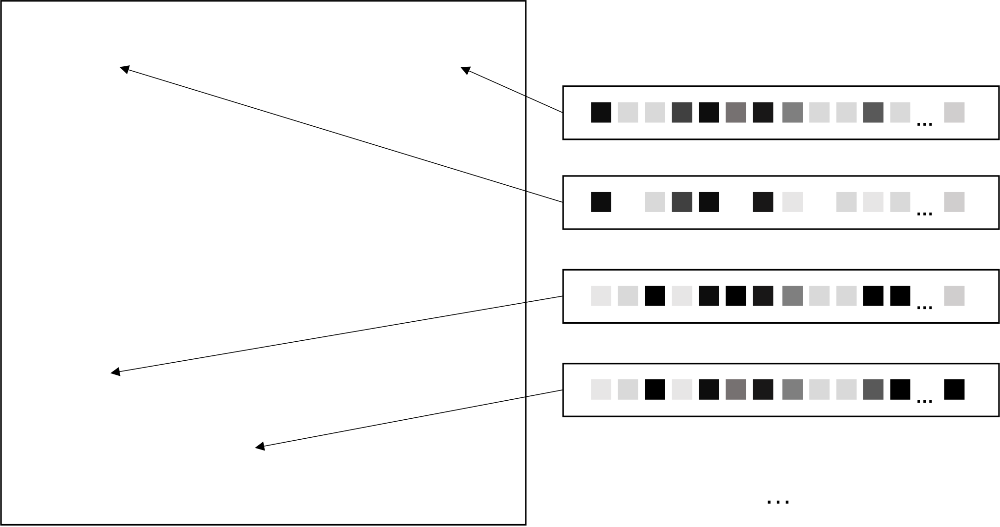
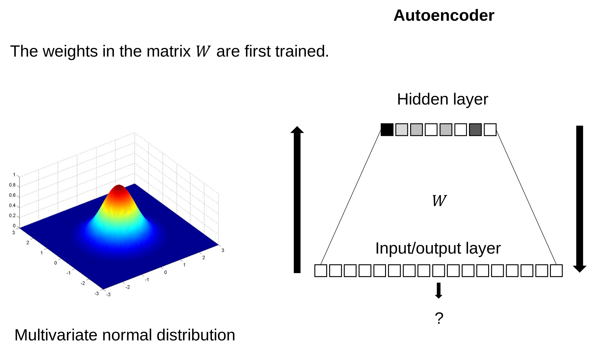
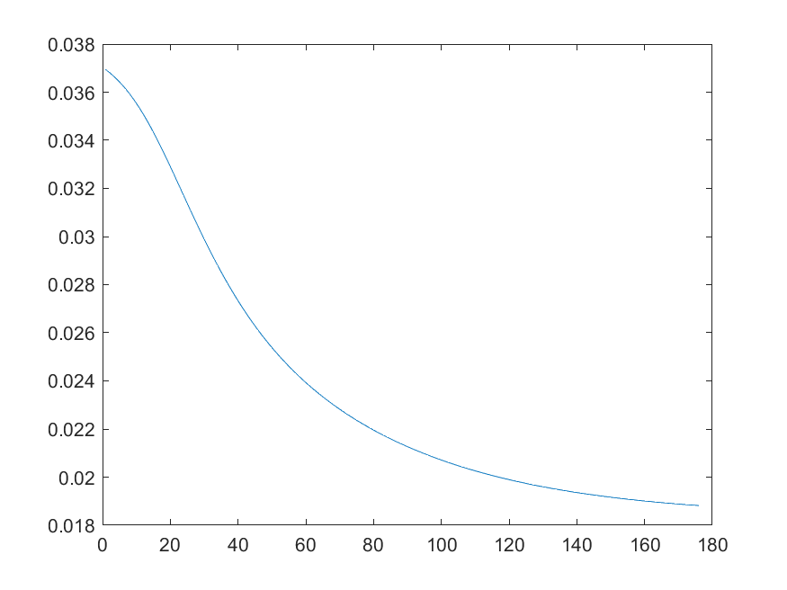
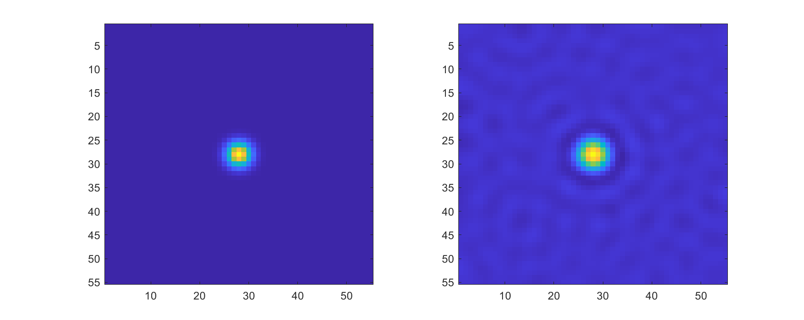

# Autoencoder to generate feature vectors

## Goal

This antoencoder is part of a larger project that aims to represent spatial information and integrate this representation into a working memory architecture.
We want to use the internal representation of an autoencoder by extracting the pattern of activation it produces in its hidden layer. This pattern of activation can then be used as a representation in a connectionist architecture.

## What is an autoencoder?

An autoencoder is a neural network model that reproduces in output the input it has received.

## The problem

We want feature vectors reprenseting coordinates in a two-dimensional space, such that the similarity between the vectors matches the psychological distance of our participants. This is illustrated in the following figure:

In other words, if we have two vectors representing two spatial locations with a small Euclidean distance, their similarity (measured using the dot product) should be greater than for two vectors representing more distant spatial locations. It would be extremely difficult to hard-code such representations.

## The solution

To solve the problem as described above, we decided to use an autoencoder, whose general architecture is illustrated in the figure bellow. The model has two layer: one input/output layer and a hidden layer. Each node in the input layer is connected to all nodes in the hidden layer.
The original vectors are drawn from a multivariate probability density function (shown in left) using the mvnpdf function as implemented in MATLAB. These are the vectors to be learned by the model. There are 55^2 vectors to learn (which represents a 55x55 pixels image).
Learning starts by feeding the original vectors into the input/output layer of the antoencoder. The activation of the input layer is then passed to the hidden layer, which produces an activation pattern. This activation pattern then fed back to the input/output layer. We then used a gradient descent method (i.e., the delta rule) to adjust the weights of the network. Learning occurs immediately after presenting a pattern. Each pattern is trained one by one until all pattern have been seen at least one. The process is then repeated for 500 iterations, or until the difference between network error at iteration i and i-1 falls below 10^(-5).

After training the network, the original patterns are fed back into the input/output layer, one by one, and the activation patterns produced in the hidden layer are used as representations. These representations are not the original patterns, but a compressed version of them. Indeed, the original vectors have a length of 3025. The patterns of the hidden only have a length of 251.

## Results

As can be seen in the figure below, the error reached an asymptote after a reasonable number (i.e., 170) of iterations. 

The figure below shows the dot product between the central vector and all vectors (after dividing them by their Euclidean norm) as produced by the original multivariate probability density function (left side) and the autoencoder (right side). As we can seen, the similarity between the vectors produced by the autoencoder recovers the similarity of the original vectors. The only exception is that we now have a compressed representation of those original vectors, which we can use in a connectionist working memory architecture, or in any other model we want!

## Conclusions

The autoencoder is a nice, convenient solution to generate vectors for computational models.